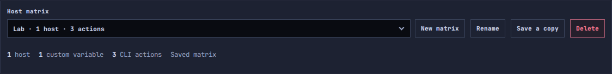
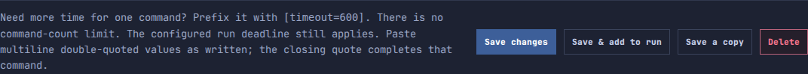

# Bulk SSH libraries and runs

A host matrix holds a reusable set of hosts, their variables, and compatible CLI
actions. The Run tab contains only the actions you explicitly choose for this run.

## Manage a matrix

Choose a matrix at the top of Bulk SSH. **New matrix**, **Rename**, **Save a copy**,
and **Delete** are beside that selector. Rename focuses the name in the Hosts
editor; save your changes to apply it.

**Save a copy** asks for a new name and copies the current host editor contents,
including edits you have not saved to the original. You can include or omit the
matrix's saved CLI actions. A copied matrix starts as a separate local object;
enable its MSO switch afterward if you want to share it. Existing matrices cannot
be overwritten through Save a copy.

The table editor, Raw matrix editor, and host importer remain available.

## Build the action library

Choose a saved CLI action or use **New CLI action**. Switching between actions
keeps unfinished drafts in the page, including a new action you have started.
Drafts are not durable saves: leaving the page or saving another action requires
discarding other unfinished edits, with a prompt before proceeding.

- **Save** keeps the current action in the matrix's library.
- **Save & add to run** saves the action, adds it once to your assembled run, and
  opens the Run tab. It does not execute commands.
- **Save a copy** asks for a new action name and saves the current editor contents
  as a separate action in this matrix. The original is unchanged.

Saving an action preserves the chosen run order, including when you rename an
action already in the run. Copying an action does not add the copy to the run.
Actions remain part of their owning matrix, including that matrix's MSO sharing.

## Review and execute

On the Run tab, add, remove, or reorder the actions for this execution. Review the
rendered commands, enter credentials, and explicitly confirm execution. Editing or
saving library content requires a fresh preview; saving never starts SSH work.
Credentials are not saved in a matrix or action.
