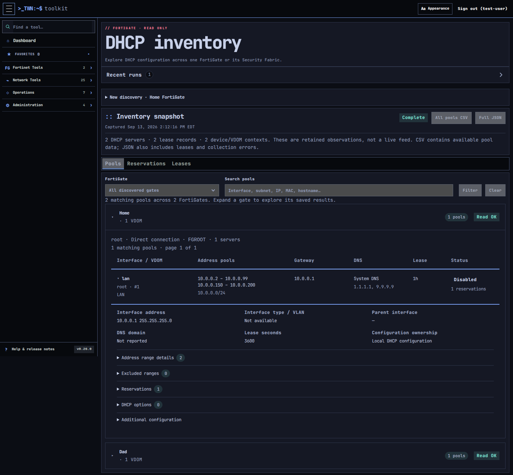

# FortiGate DHCP inventory

Open **FortiGate → DHCP inventory** and select a saved connection profile.
**This FortiGate** reads that appliance without needing Fabric discovery access.
**This FortiGate + Fabric** discovers the root and downstream FortiGates and reads
through the root using the saved API token. Enter a VDOM or leave it blank to use
the profile default. In Fabric mode, `*` reads all advertised VDOMs.

Discovery runs in the existing background diagnostic queue. Leaving the page does
not cancel the run. Recent runs are owner-scoped, collapsed by default, and subject
to the Operations diagnostic retention and deadline settings. Refresh explicitly
by starting another discovery; completed inventories do not poll appliances.

## Reading results

All three views group results into collapsed FortiGate boxes, identified by hostname,
with matching counts and collection status. Expand a gate to load its saved results;
several gates can stay open for comparison. VDOMs remain identified within each gate.

Pools shows every returned DHCP server, including disabled configurations, with
all address ranges, associated interface, mask, gateway, DNS mode/addresses and
lease duration. Expand a row for interface address/type/VLAN, domain, exclusions,
reservations, range overrides and DHCP options. System DNS is resolved separately;
failed lookups are explicit. Zero lease duration is unlimited; range-level zero
values are shown as configured and must not be confused with the server duration.

Reservations and Leases provide separate searchable views. Gate filtering and
search apply to retained data, not additional appliance reads. Views paginate at
50 entries per gate, with paging inside the expanded box. Search spans the entire
snapshot and shows matching gates, including matches beyond the first page. Opening
boxes reads saved data only; it does not contact the firewalls. Without JavaScript,
the View gate link opens the same results as a normal page. Device/VDOM collection status distinguishes an empty configuration
from missing data. CSV exports the available pools, including nested configuration
as JSON cells; Full JSON also includes leases, capture time and collection errors.
Exports contain network/client inventory and omit API tokens and credential fields.
CSV uses the shared spreadsheet-safe output encoding.

## Fabric identity and compatibility

Display labels use FortiGate hostnames; serials identify devices internally and
are available in details. A downstream request uses the discovered path:
`/csf/<root>:<downstream>/api/v2/...`. Each response must match the expected device
serial and selected VDOM. A mismatch is rejected; there is no fallback to the root.
The root's ordinary URL/token remain the only connection credentials.

Read access was verified on a FortiOS 7.6.6 root 70F and downstream 40F across a
VPN. This is not a cross-version or HA compatibility claim. The proxy path comes
from FortiOS's own GUI implementation. Other firmware/access profiles may return
unavailable data. An invalid target may time out instead of returning an error.

Reads are bounded to 32 devices, 64 device/VDOM combinations, 10,000 rows per
collection, the shared HTTP response limits, and a 900 KiB retained inventory.
Appliance pagination/limit indications are rejected rather than silently showing
an incomplete collection as complete. Narrow the scan if these limits are reached.
The diagnostic worker enforces the configured run deadline and cancellation.

This version inventories IPv4 DHCP servers and IPv4 leases only. It does not edit
configuration, renew/revoke leases, create reservations, or manage DHCPv6/relay
servers. Interface metadata may identify relay settings, but relay interfaces
without a local DHCP server are not included as pools. Standalone VDOM scans use
the requested/profile VDOM; all-VDOM discovery currently uses Fabric inventory.
