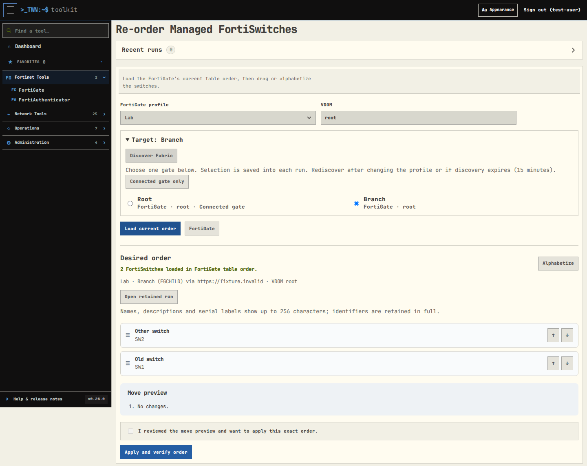

# FortiGate Fabric actions and wireless history

**Rename FortiAPs**, **Rename FortiSwitches**, **Re-order Managed FortiSwitches**,
and **Find Wireless Client History** support a selected downstream FortiGate
through your saved Fabric root connection.

Choose a profile, expand **Target: Connected FortiGate**, select **Discover
Fabric**, then choose a gate by hostname. Each action or history run targets
**one gate**. Export tools continue to support multiple selected gates. Without
Fabric discovery, these tools retain their existing direct-connection behavior.

## Review and apply

Load devices or the current switch order after selecting a gate. Rename previews
and switch-order reviews show its hostname, serial and connection origin. Review
that target along with the proposed changes before applying. Changing the target,
profile, VDOM or reviewed input requires a fresh preview. Discovery is valid for
15 minutes for new submissions, including Apply; rediscover and rebuild the preview
if it expires. Already queued jobs retain their exact target.

Browser and CSV rename workflows use the same target binding. Fabric renames use
the built-in endpoint; custom endpoints remain available with a direct connection.
Renames use each row's VDOM; switch ordering uses the selected VDOM. Existing
500-row rename and switch-order limits still apply.

Before each write, the worker verifies the selected device's identity through the
saved Fabric path. It records write intent, checks the acknowledgement and reads
back the result. Missing or mismatched identity stops the operation. An uncertain
write outcome remains **Unknown**, with no automatic replay; inspect the retained
run and reconcile the actual device before building another preview. Duplicate
submission of the same signed request resolves to its original job.

Jobs sharing a root connection remain serialized against one another, even when
selecting different downstream gates. This preserves the existing protection
against overlapping writes and stale previews. A saved profile edit also stops
pending writes until a fresh review.

## Wireless history

Choose one gate before searching for a MAC address. The retained run identifies
that gate, and both the log lookup and live-client lookup use its saved Fabric
path. A history run never combines events from different gates or retries against
the root when a downstream lookup fails. Existing partial-result messages,
pagination and request/byte/time budgets still apply. Opening the tool does not
start background Fabric polling.

## Compatibility

Routing uses the discovered `/csf/<path>/api/v2/...` proxy and checks response
serial and VDOM. `X-Target-Serial` is not used: the tested firmware ignored it.
Read paths were checked on a FortiOS 7.6.6 root 70F and downstream 40F across VPN.
Write routing, preview binding, verification and failure recovery are covered
with simulated responses; live downstream writes, other firmware, HA and multihop
paths still require operational validation. API permissions on the selected gate
must allow the requested action.

DHCP remains an investigation-only, read-only tool. See [Fabric exports](fortigate-fabric-exports.md)
for multi-gate inventory and client CSVs.
