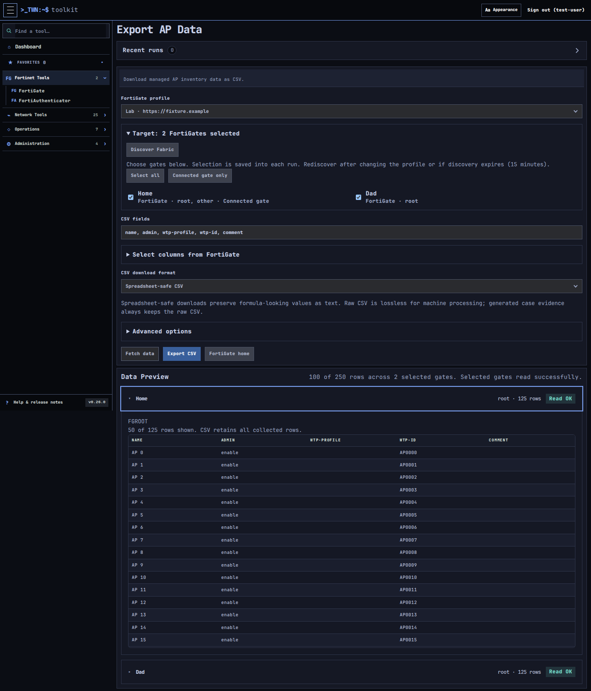

# FortiGate Fabric-aware exports

The existing **Export AP Data**, **Export FortiSwitch Data**, **Export Wireless
Clients**, and **Export FortiSwitch Clients** tasks can read selected downstream
FortiGates through a saved Fabric root connection.

Select your connection profile and expand **Target: Connected FortiGate**. Choose
**Discover Fabric**, then select gates by hostname. **Select all** selects the
currently discovered gates; **Connected gate only** selects the root. Without
Fabric discovery, the task keeps its existing direct-connection behavior.

Discovery, field loading, previews and exports use the existing background worker.
Each selected gate is read in the profile's default VDOM. Discovery expires after
15 minutes for new submissions; rediscover after expiry or after editing the
connection profile. Already queued runs keep their original credentials and exact
targets. Newly joined gates are not silently added to a queued run.

## Results and failures

Previews group results into collapsed boxes per FortiGate, showing hostname,
VDOM, row count and read status. Expand boxes independently to compare gates.
The preview shares a maximum of 100 rows across selected gates; CSV includes all
successfully collected rows. Every Fabric CSV includes **FortiGate hostname**,
**FortiGate serial**, and **FortiGate VDOM** columns alongside your selected fields.
Gate identity columns are always included in Fabric exports.

A failed gate is marked unavailable, rather than reported as an empty inventory.
A partial export contains rows from successful gates only; inspect the run's
per-gate status before treating a download as a complete inventory. If every gate
fails, no CSV download is offered. Recent runs, job pages and case recording mark
partial results as incomplete. Field discovery may use only the reachable gates.

Fabric reads use built-in task endpoints, including their existing compatibility
alternatives. Custom endpoint overrides remain available for ordinary direct
reads. Each Fabric response must match the saved device serial and VDOM; a
mismatch is rejected without falling back to the connected gate. See
[DHCP inventory](fortigate-dhcp.md) for the shared proxy/discovery behavior.

Discovery supports up to 32 gates. Each export bounds collected data to 10,000
rows and 16 MiB, in addition to existing HTTP, worker deadline, artifact quota and
browser result limits. Select fewer gates if a limit is reached. Opening results
never starts an idle polling loop or an additional appliance read.

The four default export endpoints were checked read-only on a FortiOS 7.6.6
root 70F and downstream 40F across VPN. Other firmware versions, HA and multihop
paths still need endpoint-specific validation.

DHCP remains an investigation-only, read-only tool. [AP/switch rename, switch
ordering and wireless client history](fortigate-fabric-actions.md) support one
explicit Fabric target per run.
