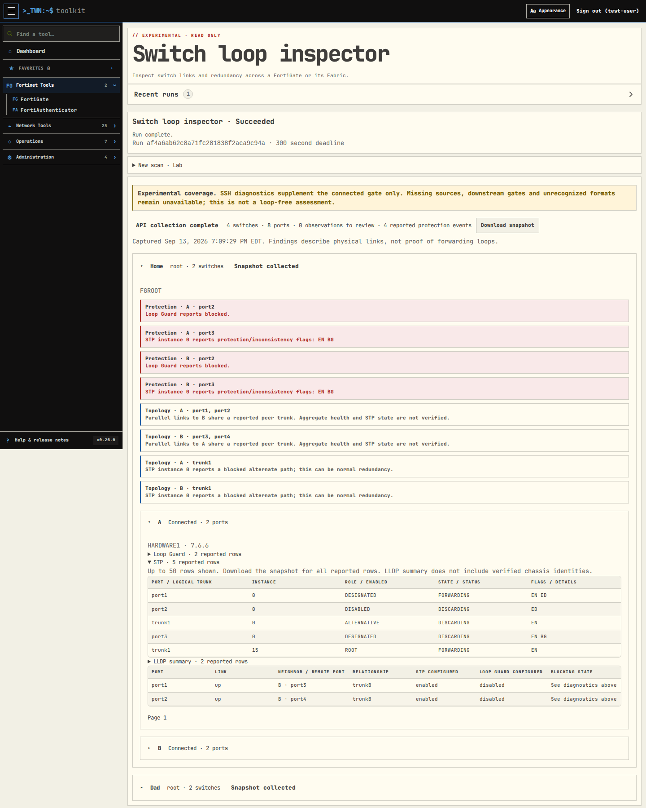

# Experimental switch loop inspector

This branch is a prototype for review, not a claim that an entire network is
loop-free. Find **Switch loop inspector** under **FortiGate → FortiSwitch Tasks**.

Choose a FortiGate profile, one VDOM, and either that gate or its Fabric. The scan
runs in the existing background worker and retains its results. Expand a gate,
then a switch, and choose **Inspect ports**. Recent runs stay collapsed by default.
A JSON download includes the complete retained snapshot; browsing results makes
no new appliance requests.

API collection shows switch identity and firmware, link state, inter-switch peers,
remote ports, reported peer trunks, FortiLink/MCLAG flags and configured guard/STP
settings. Repeated links sharing a peer trunk are topology observations. Missing or
ambiguous reciprocal links are review items, not proof of an active loop.

## Optional SSH diagnostics

Select an accessible saved Remote Terminal SSH connection to the same FortiGate.
Its assigned credential and host-key/algorithm policy are reused. The worker
verifies the FortiGate serial over SSH against the API identity before collecting
fixed, read-only Loop Guard, STP and LLDP-summary diagnostics for each managed
switch. There is no arbitrary command field or automatic remediation.

The experimental SSH supplement supports the **connected gate**, **root VDOM**,
and up to **16 switches**. It does not proxy SSH through the Fabric API. Downstream
gates keep API-only coverage unless accessed through their own direct profile and
matching SSH connection. Saved SSH options are optional; API-only runs work without
them. Connection credentials are retained in the encrypted job configuration and
are excluded from snapshots and downloads.

Loop Guard tables preserve reported enabled/state/status fields. STP tables retain
instance IDs, logical trunk names, roles, states and protection/inconsistency flags.
Disabled/discarding ports are not flagged as STP faults. Blocked alternate/backup
paths are shown as potentially normal redundancy. Explicit recognized protection
flags or Loop Guard blocking statuses are shown separately. Unrecognized, rejected,
paged or incomplete output is unavailable, never interpreted as healthy.

LLDP summary data includes all reported device types, including APs and routers;
it is not filtered to FortiSwitch neighbors. The main ports table shows the API
inter-switch relationships. LLDP summary data is displayed as reported. It does not establish full chassis
identities, so repeated device names are not classified as loops. A physical cycle
alone does not prove a forwarding loop. Missing sources and uncertain observations
remain visible; there is no overall green “no loops” verdict.

## Bounds and validation

API snapshots are limited to 32 discovered gates, 128 switches and 4,096 ports,
plus the existing 1 MiB result envelope and worker deadline. SSH uses a 60-second
collection budget, 15 seconds per command and 256 KiB per response. Partial SSH
responses are discarded. Each switch's diagnostic table displays at most 50 rows;
physical ports paginate 50 at a time. JSON retains all accepted rows. No ongoing
idle polling or automatic recovery actions are added.

Read-only live validation on a FortiOS 7.6.6 root/downstream pair collected four
switches and 76 ports. Optional SSH obtained Loop Guard, STP and LLDP summaries
from the three root-managed FortiSwitch 7.6.6 devices. The downstream FortiSwitch
3.6.12 remained API-only. The run completed in about 16 seconds. All observed Loop
Guard ports were disabled, so positive triggered-state parsing currently relies
on explicitly synthetic fixtures. Other firmware formats and actual triggered
incidents require further validation before treating this as a production locator.

No migration, dependency or version change is required. Keep this prototype on its
experimental branch until the behavior is reviewed. Drain/cancel its queued runs
before reverting to workers that do not support this job mode.
