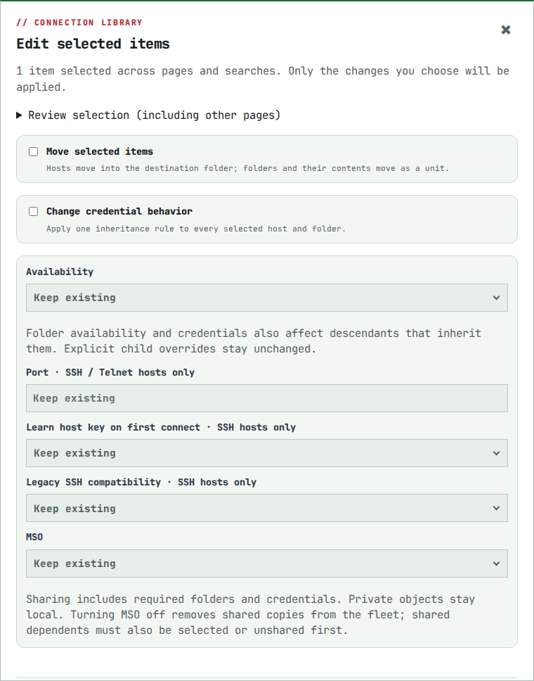

# Connection library and report pages

Remote Terminal loads 100 visible hosts per page. Previous/Next navigate the
name-sorted inventory; search runs across all visible saved hosts, including
connection details, notes, visible folder names, and available credential labels.
Folder badges say how many hosts are shown on the current page. The total host
count remains visible. Selections stay with this browser tab across paging and searches (up to 500 items).
**Visible** selects only the expanded rows currently shown; it does not select a
folder’s contents. **Edit selected** includes a review list covering other pages.
**Clear** or leaving Select mode clears the selection; a page reload also resets it.

Bulk edits default to **Keep existing**. Choose only the changes needed: move,
credentials, availability, network port, SSH trust/legacy options, or MSO when
connected to a Mainframe. Port changes require only SSH/Telnet hosts; SSH options
require only SSH hosts. Folder availability and credentials affect inheriting
descendants, while explicit overrides stay unchanged. All selected items must
belong to one owner. Permissions, dependency checks and MSO conflicts are checked
again at save time; a rejection rolls back the entire batch. MSO sharing includes
required ancestors and credentials; private objects remain local. To stop sharing
a folder, unshare its shared dependents first or include them in the selection.

Host and folder row menus offer Rename, Move, Edit, and Delete; owners also see
Duplicate. Rename changes only the label, and Move opens a one-item bulk editor
without replacing your existing selection. Only empty folders can be deleted.

The web page, library refreshes, and mutation responses use the same bounded
host projection. `/tools/remote-terminal/library` accepts `host_page` and
`host_query` and returns `library.pagination` with page, pages, total, matched,
and query. Clients that previously assumed a complete host list must follow the
pages. Saved-host lookup/connection APIs retain their identity and permission
checks. Inherited visibility and private credentials are not broadened by search.

Folder and credential pickers still load their visible indexes. This improves
large host libraries; it is not a guarantee for arbitrarily large folder or
credential indexes. Deep visibility inheritance is iterative and cycle-safe.
Concurrent edits can move an item between name-sorted pages; these are live
views, not immutable snapshots. Search again if another operator renames an item.

Case Report shows up to 50 timeline entries and 50 evidence files per page.
Saving changes only the choices displayed on that page; choices on other pages
remain intact. Unsaved selection changes trigger the browser's departure guard.
The included-item counter covers the complete saved report selection.

Interactive previews omit diagnostic payloads above 32 KiB and shorten large
fields/collections with a visible notice. This bounds browser rendering without
changing retained evidence. Print prints the displayed page. PDF and case-package
downloads retain their existing complete-selection behavior; portable cases
retain the complete journal/evidence. Exports run in supervised background jobs with adjustable input/output limits;
see [Case export jobs](case-export-jobs.md). Page size and preview envelopes are internal rendering
bounds, not retention quotas, and never discard stored records.
