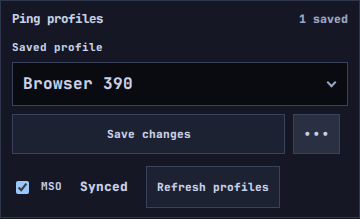
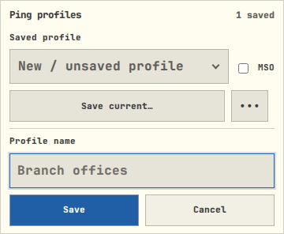
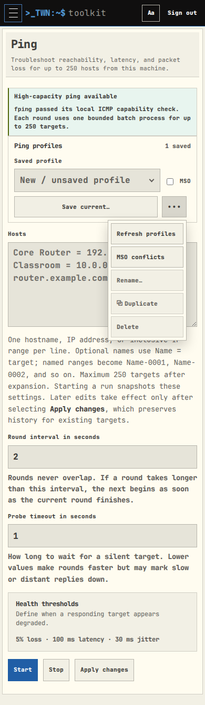
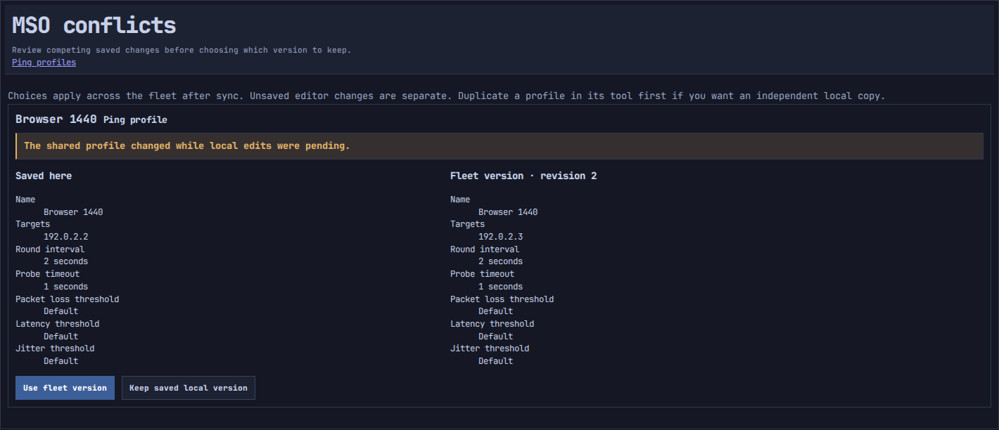
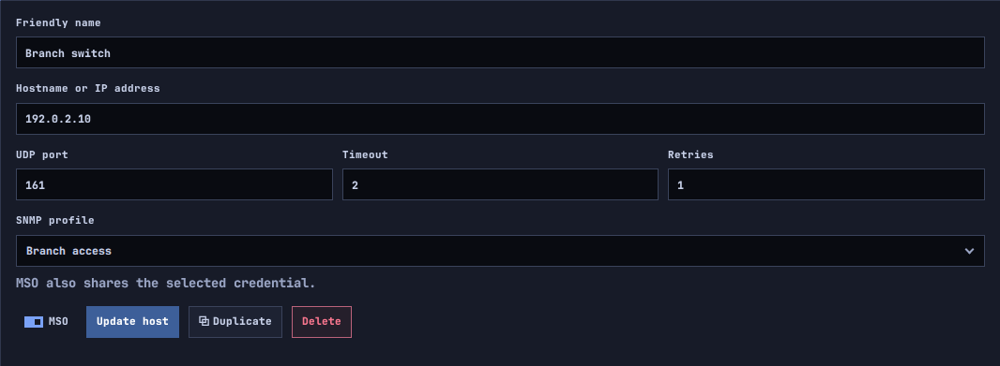
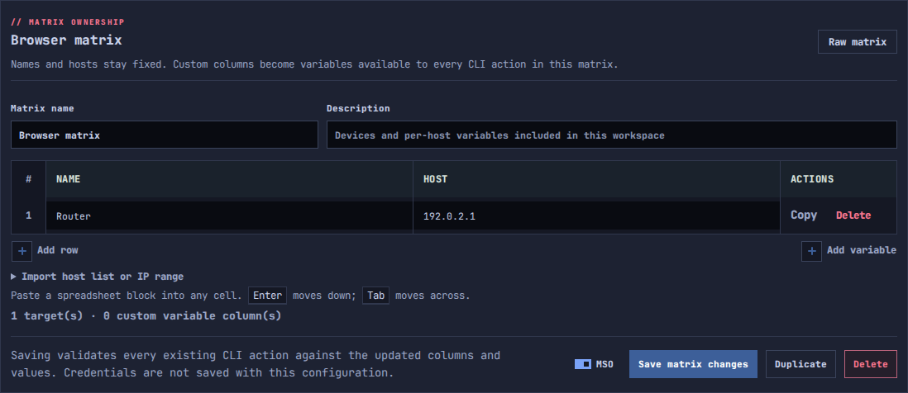
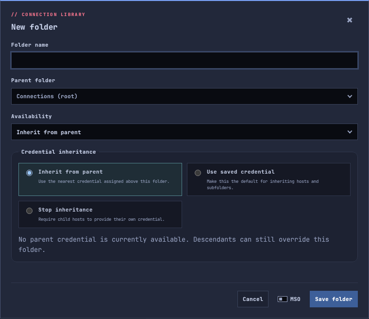

# Mainframe Synced Objects

Development v0.25.5 supports 21 object kinds: Ping; DNS queries and servers;
NTP and Traceroute targets; TCP hosts and ports; Wake-on-LAN groups; SNMP hosts,
credentials and OIDs; RADIUS attributes, servers and credentials; LLDP personas;
FortiGate and FortiAuthenticator profiles; Bulk SSH matrices; and Remote Terminal
folders, credentials and hosts. Automations and Certificates/PKI remain deferred.
Cases, files, SMTP and dashboard preferences are outside this rollout.

## Using it

Connect an Agent to a Mainframe, or use the Mainframe itself. Select or
create a saved profile, enable **MSO · Sync with Mainframe**, and save. The profile
is shared with the whole enrolled fleet; there are no destination selectors.
Existing and newly created profiles remain local unless MSO is enabled.

Operational MSO controls and conflict management are available only in Mainframe
or Agent mode. Standalone mode keeps the normal local profile controls and omits
the MSO toggle, refresh action, conflict link, and MSO help topic. Direct conflict
management URLs are unavailable there. Historical release notes still describe
the feature.

Create, rename, edit, disable MSO, or delete from any participating instance using
its existing permission for that tool. Origin identifies where an object began; it does
not restrict editing. Receiving a profile never starts a diagnostic or changes an active
run. LLDP personas do not select an interface or start transmission. The receiving machine's installed Ping engine still determines which target
counts and timeouts it can execute.

The MSO toggle uses a small square-edged switch beside its label, with no permanent
button box. Its click target matches the adjacent Save action's height. The thumb
moves right when enabled. It sits beside the saved-profile dropdown, or beside Save in card-based editors. Its tooltip reports
the saved state without adding a permanent status row. Conflicts link to central
review. Ping additionally shows Pending, Changed, Removed, and Unavailable during
its background status checks. Pending changes
remain on disk while offline and retry through the enrollment worker. Synced
means the Mainframe accepted this revision; it does not assert every offline
Agent has received it. Use **••• → Refresh profiles** to discover newly received items
or explicitly load a changed saved version. Background status checks preserve
unsaved editor contents.

The **•••** menu is available even with no profile selected. It provides
**Refresh profiles** and **MSO conflicts**; the latter reads **Review conflicts**
when the selected profile has a conflict. Refresh reloads saved data already
present on this instance and asks before replacing editor contents. It does not
force a network sync; that continues automatically in the background.

## Conflicts in one place

Other saved-list editors show **Review conflict** when a loaded object needs
attention. Reload the page to discover incoming lists or load a newer saved
version; save other drafts first. Saving or deleting a stale shared object is
rejected rather than overwriting a newer revision. The conflict workspace only
shows types the current user can access and checks that permission again when
resolving a conflict.

RADIUS attribute values and custom LLDP TLVs are shared as entered. Treat these
as fleet-visible content when enabling MSO; SNMP hosts include their selected credential as described below.

**Review conflicts** opens the shared **MSO conflicts** page. It is also available
under the Ping profile's More actions menu. Resolution controls live there,
not in each tool's editor. The page shows conflicts on the instance you
are currently using, including through a Mainframe agent tab. It cannot inspect
an offline Agent's unsent draft.

Compare the saved local and fleet versions, then choose **Use fleet version** or
**Keep saved local version**. These choices use saved data, not an unsaved editor
buffer. Duplicate first in the owning tool if you want an independent local copy. A deleted
shared object cannot be resurrected by a stale offline edit: accept the removal
or retain a local duplicate. If another change arrives while reviewing, refresh
the conflict before choosing again.

Different UUIDs with the same name are never silently merged. An incoming
collision appears with an identifying suffix and a conflict. Rename the existing
local profile, then use the fleet version, or explicitly keep the suffixed name.

## SNMP hosts and credentials

Enabling MSO on a host also shares its selected credential. The selector explains
this before saving. A credential can also be shared independently using its own
MSO switch. Existing credentials and hosts start local after migration.

Hosts reference credential UUIDs, not names. A credential rename updates the host's
displayed selection without rebinding it. Incoming name collisions preserve the
unrelated local credential and require conflict review. A missing or conflicted
credential prevents new SNMP tests or monitors from using that host until resolved.
An already running operation retains its existing configuration.

Credentials are published before dependent hosts. Both the local store and the
Mainframe enforce the dependency: a credential cannot be made local or deleted
while shared hosts still reference it. Reassign those hosts or turn off their MSO
first. This also applies to queued changes from offline Agents. Disabling a host
does not implicitly unshare a credential that other hosts may use.

Communities and authentication/privacy passphrases are protected with each
instance's existing secret key in saved objects, hub records, pending deliveries,
and conflicts. Exchange uses the authenticated enrollment transport. HTML, save
responses, and conflict comparisons do not disclose secret values. Preserve the
instance key with recovery data. Portable credential exports retain the existing
sensitive-export protections and import as local objects.

## Appliance, RADIUS and Bulk SSH libraries

FortiGate profiles include their API keys; FortiAuthenticator profiles include
login credentials. RADIUS server profiles include shared secrets, and test
credentials include passwords. Secrets use the same protected storage and
redacted conflict comparison as SNMP credentials. Choosing a default Fortinet
profile affects only the current instance; sharing does not select a remote default.

A Bulk SSH matrix, its host variables and its CLI actions form one shared object.
Edits to any of these use the matrix revision, so concurrent edits require central
conflict review. Matrix and command text are encrypted at rest; authorized editors
and conflict reviewers can see their contents. Legacy command sets remain available
for copying into matrices; they do not become a second shared library. Receiving
an action never queues or executes it. Runbooks and run history remain local.

## Remote Terminal libraries

Only **Global** and **Admins Only** objects can use MSO. **Private** objects stay
local. Sharing a host includes its entire folder path and selected or inherited
credential. Eligible dependencies are shared automatically; a private dependency
blocks the save without creating a partially shared host or changing visibility.
A shared folder may contain local children, including private children belonging
to its local owner. Serial-console definitions remain local to their hardware.

Folder and credential references use UUIDs, including during bidirectional moves
and renames. Received libraries retain an opaque owner identity; accounts are not
created or matched by username. Administrators can manage received shared objects
and add shared children in the same library. Existing visibility permissions still
apply. A host-specific credential withdraws with its host; reusable credentials
stay shared until explicitly withdrawn and cannot be withdrawn while shared
objects depend on them. New connections are blocked while their shared host or
credential dependencies have an unresolved conflict. Existing sessions continue.

The compact switch sits beside Save in each folder, host and credential editor.
Save first, then reload the library to see incoming changes. Concurrent shared
library edits can require a reload before saving another open editor. Conflict
resolution stays on the central page, accessible from the Remote Terminal header
even if the conflicted object has been deleted locally. Turning off MSO preserves the acting
instance's native object; receiving peers remove their replicas after syncing.
Folders or credentials needed by local children are retained locally.

Native terminal data remains in `remote_connections.sqlite3`; a durable link table
connects it to MSO identities. Native IDs survive withdrawal and leaving the fleet.
Portable backups retain shared-library ownership as an opaque identity but import
without MSO membership. They never map a received library to a same-named account.
Withdraw active objects before replacing the library. Recovery snapshots preserve
native data and publication links together with the MSO store.

## Removing or leaving

- **Disable MSO:** keep an independent local copy on the acting instance and
  remove the shared replicas from the Mainframe and other Agents as they sync.
  Profile copies get fresh UUIDs; Remote Terminal retains its native ID and drops the MSO link. The confirmation states this fleet-wide effect.
- **Delete an MSO:** remove the shared profile everywhere as peers sync, without
  retaining a new local copy. Concurrent offline changes remain explicit conflicts.
- **Duplicate:** always create a fresh local object, even when the source is MSO.
- **Leave/change coordination role:** preserve available profiles as independent
  local objects with new UUIDs and discard their MSO membership. Late replies
  from the old membership cannot reattach them.
- **Revoke an Agent:** existing certificate approval checks stop further sync.
  MSO does not remotely erase saved data already held by that Agent.

## Compatibility and recovery

Upgrade Mainframe and participating Agents to a build supporting the desired list
kinds. The heartbeat advertises supported types. Original Ping-only peers continue
to exchange Ping objects; additional lists wait until both peers support them.
Peers predating MSO remain enrolled without participating. On gaining support for
new list kinds, an Agent rescans fleet history without replacing newer local edits
or forgetting the last revision it already received. Capability changes cannot
mask a Mainframe recovery below that known revision.
Sync errors are separate from an otherwise healthy Agent connection.

Each participating JSON profile library migrates once from its existing file into the
owner-readable `mso.sqlite3` database. Existing entries retain their values and
start local, with stable UUIDs. Legacy JSON files remain as migration sources but
are no longer active stores after migration. Receiving a list first migrates any
legacy local entries of that type, so a matching name cannot overwrite local data.
Unrelated libraries are not read as part of that migration.

Portable configuration exports contain profile values, without fleet identity
or membership. Imported profiles are independent local objects. Replacing or
merging a participating library with active, pending, or conflicted MSOs is rejected:
resolve/withdraw those objects first. A failed multi-group import restores the
original UUIDs and pending operations. Recovery points include the SQLite store
and its matching code. Restoring an older Mainframe may require explicit
reconciliation if an Agent has a cursor beyond the restored history; MSO
does not silently reset a recovery cursor or support moving Agents between Mainframes.

## Framework boundaries

The shared store, authenticated exchange, revision checks, durable proposals,
acknowledgements, tombstones and membership epoch are independent of Ping data.
Types are registered with explicit payload validators; adding a new type also
requires a permission-aware UI/storage adapter and its own migration/tests.
There is no arbitrary file replication; credential fields require an explicit adapter.

Each exchange carries at most four proposals and four changed records. A shared
object is limited to 64 KiB; Ping accepts up to 250 targets. The store retains up
to 5,000 shared identities, including deletion tombstones, and 10,000 recent
operation receipts. Tombstones prevent stale resurrection. Reaching the identity
limit produces an explicit error; automatic tombstone retirement and fleet-wide
conflict aggregation remain outside this rollout.

## Two-instance acceptance

1. On Mainframe, enable MSO on a disposable saved list and save. On the Agent,
   reload the tool and verify its values, then edit its name or contents and
   save. Reload on Mainframe and verify the change without running the tool.
   Repeat with each supported list type; for LLDP, save a persona without starting it.
2. Disconnect the Agent; save a profile edit there and another edit to the same
   profile on Mainframe. Reconnect, open Review conflicts on the Agent, compare
   both versions and resolve. Confirm the chosen version on both instances.
3. Disable MSO on the Agent for a Mainframe-created profile. Confirm it becomes
   local there and disappears on Mainframe. Repeat with shared Delete and verify
   both copies disappear. Duplicate an MSO and verify the duplicate stays local.
